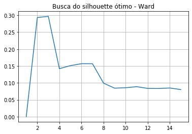
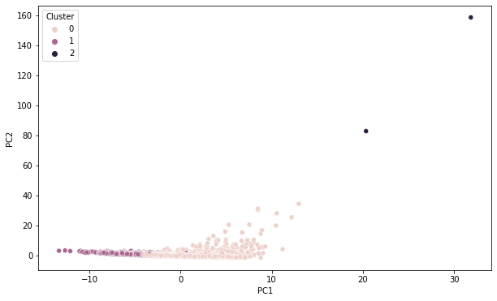
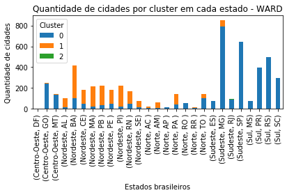

# PUC-MBA
Trabalho de conclusão do MBA PUC-Rio

## TEMA CENTRAL
Este trabalho tem por ideia central a utilização de metodologias já difundidas para calcular uma pontuação (score) com relação à igualdade de gênero para todos os municípios brasileiros. Baseada nos critérios apresentados pelo índice GGI - Global Gender Gap Index, a ideia central é partir desta nova variável – somada às demais variáveis escolhidas - encontrar agrupamentos e características que permitam distinguir perfis de cidades que possuem maior igualdade de gênero.

## OBJETIVO:
* Analisar quais perfis de municípios brasileiros são possíveis distinguir com relação à igualdade de gênero.

## BASE DE DADOS:
A base de dados foi construida pela autora, é resultado de uma composição de três fontes distintas: 

**Dados para construção do score de gênero:** Censo 2010- IBGE, Tribunal Superior Eleitoral (TSE) – Eleições 2010 (governadores e senadores), Tribunal Superior Eleitoral (TSE) – Eleições 2008 (prefeitos e vereadores).

**Dados básicos municipais:** publicados do Altas de Desenvolvimento Humano (IPEA, 2013), que consolida os principais dados do censo 2010 realizado pelo IBGE, a nível municipal.

**Dados gerais municipais:** obtidos através de raspagem de dados no site IBGE cidades (https://cidades.ibge.gov.br/brasil). 

## METODOLOGIA
Após avaliação e tratamento dos dados faltantes na base de dados, a base foi padronizada para posterior utilização nos algoritmos selecionados: K-Means e Agglomerative Clustering. Foi utilizada uma abordagem de otimização de hiperparâmetros para verificação do número de clusters ideais para cada algoritmo e avaliados através do método Silhouette e Elbow, identificou-se que o numero mais adequado para este dataset seria 3 clusters.

 

## APLICAÇÃO DOS ALGORITMOS
### 1. K-Means
Ao aplicar o K-Means, usando os dados padronizados e como parâmetro n_clusters=3, observou-se uma grande concentração de cidades nos clusters 0 e 1 e apenas duas cidades no cluster 2 (Rio de Janeiro-RJ e São Paulo-SP). Para melhor visualização dos dados, foi aplicado o PCA para redução de dimensionalidade.

 

Identificando os medóides de cada cluster, temos as cidades de AQUIDABÃ (Sergipe), Conceição das Alagoas (MG) e Rio de Janeiro (RJ), como instâncias mais próximas dos clusters 0, 1, 2 respectivamente.

| ID   | PC1       | PC2       | Cluster | Cidade                |
|------|-----------|-----------|---------|-----------------------|
| 1752 | -3.858694 | 0.424743  | 0       | AQUIDABÃ              |
| 2432 | 2.923431  | -0.370503 | 1       | CONCEIÇÃO DAS ALAGOAS |
| 3241 | 20.344651 | 82.705380 | 2       | RIO DE JANEIRO        |

A divisão de quantidade de cidades por região e cluster segue detalhada na tabela abaixo:

| Região       | Cluster | Qtd Municípios |
|--------------|---------|----------------|
| Centro-Oeste |       0 |             52 |
| Centro-Oeste |       1 |            336 |
|     Nordeste |       0 |           1709 |
|     Nordeste |       1 |             85 |
|        Norte |       0 |            384 |
|        Norte |       1 |             65 |
|      Sudeste |       0 |            230 |
|      Sudeste |       1 |           1436 |
|      Sudeste |       2 |              2 |
|          Sul |       0 |             47 |
|          Sul |       1 |           1219 |

Podemos observar também que regiões Norte e Nordeste possuem a maioria dos seus municípios classificados como Cluster 0, enquanto que nas demais regiões, a maioria dos municipios foi classificada como Cluster 1. O gráfico abaixo mostra a quantidade de cidades por cluster em cada Região e Estado.

##### 1.1. Principais atributos encontrados na análise PCA

A partir da análise dos componentes principais, obtemos os principais atributos de importancia para o PC1: 

| Componente - Atributo | Sigla  | Descrição                                      | Valor                |
|-----------------------|--------|------------------------------------------------|----------------------|
| PC1 - Atributo 1      | IDHM   | Índice de Desenvolvimento Humano Municipal     | 0.24852673182935706  |
| PC1 - Atributo 2      | PPOB   | Proporção dos indivíduos vulneráveis à pobreza | -0.24840113745965    |
| PC1 - Atributo 3      | PMPOB  | Proporção dos indivíduos pobres                | -0.24701777816944107 |
| PC1 - Atributo 4      | IDHM_R | Índice da dimensão Renda Municipal             | 0.24524833357182915  |

Para o componente 2, temos:

| Componente - Atributo | Sigla     | Descrição                           | Valor               |
|-----------------------|-----------|-------------------------------------|---------------------|
| PC2 - Atributo 1      | HOMEMTOT  | População residente masculina       | 0.33994685448122    |
| PC2 - Atributo 2      | TPM       | População municipal no último censo | 0.33988219209530224 |
| PC2 - Atributo 3      | MULHERTOT | População residente   feminina      | 0.3397811294723905  |
| PC2 - Atributo 4      | PEA       | População economicamente ativa      | 0.3389914820057626  |

### 2. Agglomerative Clustering

Outra abordagem foi aplicando a metodologia de clustering hierárquico, com o mesmo numero de clusters n=3 e tipo de linkage='Ward'.
Para melhor visualização dos dados, foi aplicado o PCA para redução de dimensionalidade. O resultado foi bem semelhante ao algoritmo anterior, com grande concentração de cidades nos clusters 0 e 1 e apenas duas cidades no cluster 2 (Rio de Janeiro-RJ e São Paulo-SP).

 

A divisão de quantidade de cidades por região e cluster segue detalhada na tabela abaixo:

| Região       | Cluster | Qtd Municípios |
|--------------|---------|----------------|
| Centro-Oeste |       0 |            381 |
| Centro-Oeste |       1 |              7 |
|     Nordeste |       0 |            338 |
|     Nordeste |       1 |           1456 |
|        Norte |       0 |            229 |
|        Norte |       1 |            220 |
|      Sudeste |       0 |           1607 |
|      Sudeste |       1 |             59 |
|      Sudeste |       2 |              2 |
|          Sul |       0 |           1261 |
|          Sul |       1 |              5 |

 O gráfico abaixo mostra a quantidade de cidades por cluster em cada Região e Estado.
 
 

## RESULTADOS

A partir dos modelos aplicados, verificamos a relação com os valores do score de igualdade de gênero "SCO", original do dataset para analisarmos os resultados e, comparando os dois algoritmos, temos que:

1) para os clusters semelhantes de scores mais altos (cluster 0 no KMEANS e cluster 1 no Hierarquico), conseguimos observar uma diferença de 625 cidades entre os dois algoritmos. Mesmo com essa diferença de agrupamento, a mediana dos scores permanece bem semelhante, aproximadamente 0.76. Nesses agrupamentos percebemos uma grande concentração de cidades do norte e nordeste.
2) para os clusters semelhantes de scores mais baixos (cluster 1 no KMEANS e cluster 0 no Hierarquico), conseguimos observar uma diferença de 675 cidades entre os dois algoritmos. Mesmo com essa diferença de agrupamento, a mediana dos scores permanece próximo, aproximadamente 0.74. Nesses agrupamentos percebemos uma grande concentração de cidades do sul, sudeste e centro-oeste.
3) Rio de Janeiro e São Paulo foram destoantes das demais cidades, representadas no cluster 2, com mediana de score de 0.77

